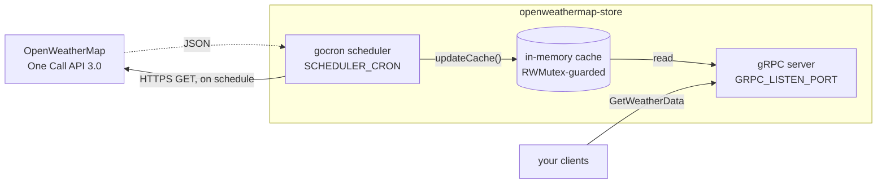

# OpenWeatherMap Store

[](https://go.dev/)
[](https://docs.docker.com/compose/)
[](https://grpc.io/)
[](LICENSE)

A small Go service that polls the **OpenWeatherMap One Call API 3.0** on a schedule, caches the
result in memory, and serves it over **gRPC**.

The point is to put a buffer between your clients and OpenWeatherMap: however many clients ask for
weather data, and however often, the upstream API is called only on your schedule — so reads are
never bound by the API's rate limit, and your API key stays in one place.

The gRPC contract lives in
[proto-definitions-go](https://github.com/giedrius-slegeris/proto-definitions-go/blob/main/protos/openweathermap-store.proto).

---

## How it works



Two things worth knowing about the cache:

- It is **in-memory only** — a restart empties it, and the next scheduled tick refills it.
- Until the first fetch succeeds, `GetWeatherData` returns gRPC status **`UNAVAILABLE`**
  (`"Weather data unavailable"`) rather than an empty payload.

Each successful fetch stamps `LastUpdated` with the current UTC Unix time, so clients can tell how
stale the data they receive is.

---

## Prerequisites

- **Docker** with Compose v2 (`docker compose`) — this is the only requirement for running.
- **Go 1.27+** — only if you want to build or run outside a container.
- An **OpenWeatherMap API key with One Call API 3.0 enabled**. The 3.0 endpoint needs its own
  subscription; a plain free-tier key will come back `401`.

---

## Configuration

Create a `.env` file in the project root. Compose reads it automatically, and it is gitignored so
your key stays out of version control.

| Variable | Example | Description |
|---|---|---|
| `OPEN_WEATHER_MAP_API_KEY` | `yourProvisionedApiKey` | One Call API 3.0-enabled access key |
| `OPEN_WEATHER_MAP_BASE_URL` | `https://api.openweathermap.org/data/3.0/onecall` | Upstream endpoint. Currently tailored to One Call |
| `OPEN_WEATHER_MAP_LATITUDE` | `51.500937` | Latitude to report on |
| `OPEN_WEATHER_MAP_LONGITUDE` | `-0.124602` | Longitude to report on |
| `OPEN_WEATHER_MAP_UNITS` | `metric` | Either `metric` or `imperial` |
| `TIMEZONE` | `Europe/London` | IANA zone the cron schedule is evaluated in |
| `SCHEDULER_CRON` | `*/5 * * * *` | Standard 5-field cron. This example polls every 5 minutes |
| `GRPC_LISTEN_PORT` | `10060` | Port the gRPC server listens on, published to the host |

All eight are required — the service reads them straight from the environment with no defaults.

<details>
<summary>Example <code>.env</code></summary>

```dotenv
OPEN_WEATHER_MAP_API_KEY=yourProvisionedApiKey
OPEN_WEATHER_MAP_BASE_URL=https://api.openweathermap.org/data/3.0/onecall
OPEN_WEATHER_MAP_LATITUDE=51.500937
OPEN_WEATHER_MAP_LONGITUDE=-0.124602
OPEN_WEATHER_MAP_UNITS=metric
TIMEZONE="Europe/London"
SCHEDULER_CRON="*/5 * * * *"
GRPC_LISTEN_PORT=10060
```

The quotes around `SCHEDULER_CRON` matter: unquoted, the `*` characters glob-expand if you ever
source the file in a shell (as the non-Docker instructions below do). Compose strips the quotes, so
they are safe either way.

</details>

> [!TIP]
> Pick `SCHEDULER_CRON` to suit your OpenWeatherMap plan. Every 5 minutes is 288 calls a day —
> comfortably inside the 1,000/day that One Call 3.0 includes before it starts charging.

---

## Running

### With Docker Compose

```bash
docker compose up --build
```

The service logs `Server is listening on port <GRPC_LISTEN_PORT>` once it is up, then a
`Updating cache with new API results` line on every successful poll.

To run it in the background, and to stop it:

```bash
docker compose up -d --build
docker compose logs -f
docker compose down
```

`restart: always` is set, so the container comes back after a daemon restart or a crash.

### Without Docker

```bash
set -a && . ./.env && set +a     # load .env into your shell
go build -o openweathermap-store .
./openweathermap-store
```

---

## gRPC API

One unary method:

```
openweathermapstore.OpenWeatherMapStoreServer/GetWeatherData
```

`GetWeatherDataRequest` takes no fields. `GetWeatherDataResponse` mirrors the One Call payload:

| Field | Type | Notes |
|---|---|---|
| `LastUpdated` | `int64` | UTC Unix seconds of the last successful fetch |
| `Lat` / `Lon` | `float32` | Coordinates the data is for |
| `Timezone` | `string` | IANA zone name for the location |
| `TimezoneOffset` | `int32` | Shift from UTC in seconds |
| `Current` | `Current` | Current conditions |
| `Minutely` | `[]Minutely` | Minute-by-minute forecast |
| `Hourly` | `[]Hourly` | Hourly forecast |
| `Daily` | `[]Daily` | Daily forecast |
| `Alerts` | `[]Alert` | Government weather alerts, when any are active |

### Poking at it

The server registers the gRPC **reflection** service, so tools can discover the schema over the
wire — no local copy of the `.proto` needed:

```bash
# list services
grpcurl -plaintext localhost:10060 list

# inspect the service
grpcurl -plaintext localhost:10060 describe openweathermapstore.OpenWeatherMapStoreServer

# fetch the cached weather data
grpcurl -plaintext localhost:10060 \
  openweathermapstore.OpenWeatherMapStoreServer/GetWeatherData
```

> [!NOTE]
> Reflection publishes your schema to anything that can reach `GRPC_LISTEN_PORT`. That is a
> convenience on a private network; if you ever expose the port more widely, drop the
> `reflection.Register(gs)` call in `main.go` and pass the `.proto` to your tools instead
> (`-import-path ./protos -proto openweathermap-store.proto`).

Go clients can import the generated package directly:

```go
import pb "github.com/giedrius-slegeris/proto-definitions-go/openweathermapstore"

conn, err := grpc.NewClient("localhost:10060",
    grpc.WithTransportCredentials(insecure.NewCredentials()))
if err != nil {
    log.Fatal(err)
}
defer conn.Close()

resp, err := pb.NewOpenWeatherMapStoreServerClient(conn).
    GetWeatherData(ctx, &pb.GetWeatherDataRequest{})
```

---

## Project layout

```
.
├── api/api.go           OpenWeatherMap HTTP client (URL building, timeouts, JSON decode)
├── cron/cron.go         gocron scheduler wiring, timezone-aware
├── grpc.go              GetWeatherData handler — serves the cache under a read lock
├── main.go              wiring: scheduler + cache + gRPC server
├── Dockerfile           multistage build, Alpine runtime
└── docker-compose.yml   service definition, env and port wiring
```

The API client is deliberately decoupled from the cache: `main.go` wraps `api.Get()` in a callback
that writes to the cache, so fetching and caching stay independently testable.

---

## Docker image

A multistage build compiles a static binary with the official Go Alpine image, then copies just that
binary into a bare `alpine:3.24` runtime — about **22 MB** total.

The runtime installs two packages, both load-bearing:

- **`ca-certificates`** — verifying TLS on the HTTPS call to OpenWeatherMap.
- **`tzdata`** — `time.LoadLocation()` resolving `TIMEZONE` for the scheduler.

The build stage uses `network: host` so package and Go module fetches resolve DNS reliably; the
container itself runs on Compose's normal bridge network and publishes only `GRPC_LISTEN_PORT`. The
binary runs as `nobody`, and BuildKit cache mounts keep the module and build caches warm between
builds.

---

## Troubleshooting

| Symptom | Cause |
|---|---|
| `no port specified: :<empty>` on `docker compose build` | `.env` is missing or has no `GRPC_LISTEN_PORT` — Compose needs it to resolve the port mapping |
| `401 Unauthorized` in the logs | The key is wrong, or not subscribed to One Call API **3.0** |
| `UNAVAILABLE: Weather data unavailable` from gRPC | No successful fetch yet. Wait for the first `SCHEDULER_CRON` tick, or check the logs for a fetch error |
| `Failed to start cron task` at startup | `TIMEZONE` is not a valid IANA name, or `SCHEDULER_CRON` is not valid 5-field cron |
| `bind: address already in use` | Something else already holds `GRPC_LISTEN_PORT` on the host |

---

## License

[MIT](LICENSE) © Giedrius Slegeris
